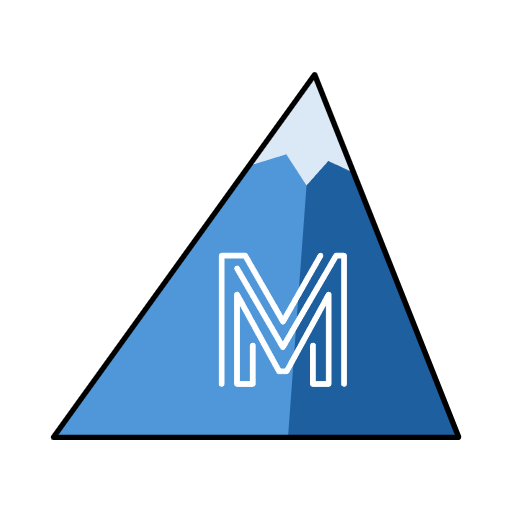
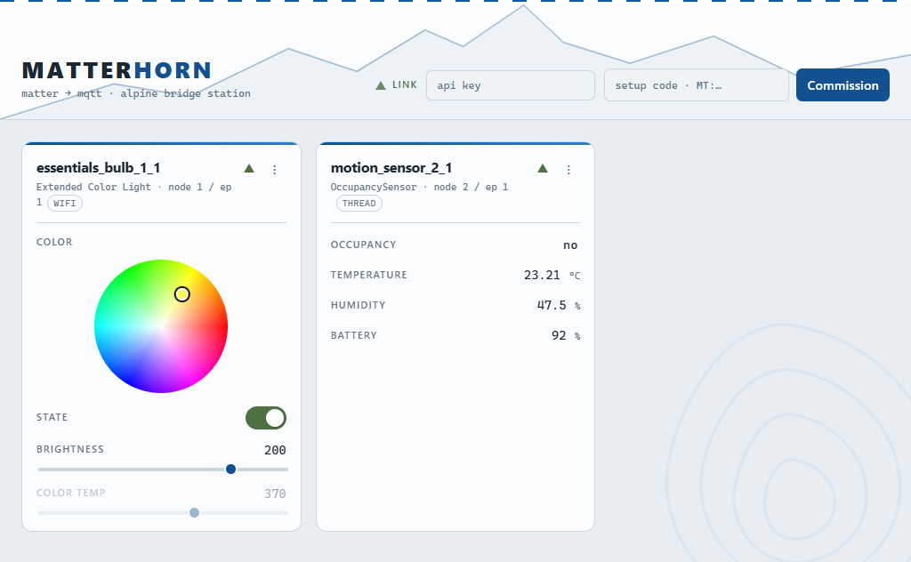

<p align="center">
  
</p>

# Matterhorn

[](https://dirnei.github.io/matterhorn/)
[](https://github.com/dirnei/matterhorn/releases)
[](https://github.com/dirnei/matterhorn/pkgs/container/matterhorn)
[](https://github.com/dirnei/matterhorn/actions/workflows/docs.yml)
[](https://dotnet.microsoft.com)

**A neutral bridge that puts your Matter devices on MQTT — the Zigbee2MQTT of Matter.**

Matterhorn commissions Matter devices (or joins ones already paired to Apple Home / Google via
Matter's multi-admin), and re-publishes them as a Zigbee2MQTT-shaped **MQTT** surface, a **REST**
API, and a small **web dashboard**. MQTT and REST are two projections of one internal model —
anything you can see or do on one, you can on the other.

<p align="center">
  <picture>
    <source media="(prefers-color-scheme: dark)" srcset="docs/public/dashboard-dark.png" />
    
  </picture>
</p>

## Why

Matter was supposed to end smart-home lock-in, but in practice a device ends up tied to whatever
app commissioned it — Apple Home, Google Home, Alexa — and getting it into your *own* automations
usually means routing through that vendor's hub or cloud.

## How it works

```
Matter device ──(Matter/IP)── matterjs-server ──(WebSocket)── Matterhorn ──┬── MQTT broker
                                                                           ├── REST API
                                                                           └── Web dashboard (SSE)
```

Matterhorn does **not** speak Matter to devices directly. It drives a
[matterjs-server](https://github.com/matter-js/matterjs-server) instance, which does the
commissioning and low-level Matter work.

That controller must run on a **Linux host on your LAN with host networking** — Matter commissioning
needs mDNS + IPv6 link-local access to the device, which Docker Desktop on Windows/macOS can't
provide. A **Raspberry Pi** (64-bit OS, IPv6 enabled) is ideal. Matterhorn itself can run anywhere
that can reach that host.

## Quick start

Boots Matterhorn with an in-memory fake controller and two seeded demo devices, plus an MQTT broker:

```bash
docker compose up --build
```

| What | Where |
|---|---|
| Web dashboard | http://localhost:16090/ |
| Swagger UI | http://localhost:16090/swagger |
| REST API | http://localhost:16090 (e.g. `GET /api/devices`) |
| EMQX dashboard | http://localhost:16083 — login `admin` / `public` |
| MQTT broker | `localhost:16883`, base topic `matterhorn` |

## Documentation

Full docs — getting started, commissioning, MQTT & REST control, configuration,
and the REST API — live at **<https://dirnei.github.io/matterhorn/>**.

## Development

```bash
dotnet build                                   # build (regenerates the API from the contract)
dotnet test src/Matterhorn.Test                # run the test suite
```

For iterating on the app without Docker you can run it directly against a controller:

```bash
Controller__Kind=matterjs-server Controller__WsUrl=ws://<pi-ip>:5580/ws \
  dotnet run --project src/Matterhorn        # REST + dashboard on http://localhost:5006
```
